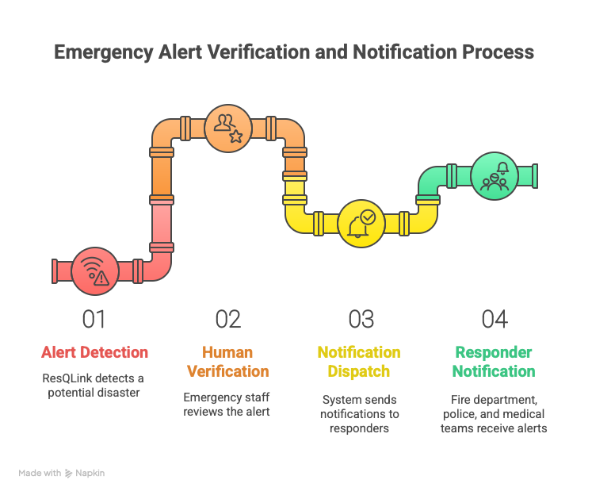

## Project Name

ResQLink

## Theme

Human-in-the-Loop Disaster Detection and Response System for Sustainability in Disaster Management

---

## Overview
ResQLink is a disaster detection and response platform designed for sustainability and accuracy. It combines **AI automation** with **human verification** to detect potential disasters, confirm alerts, and dispatch the right emergency responders — ensuring quick, reliable, and resource-efficient action.

---

## Local Git Repository
Clone the project locally using:

git clone https://github.com/edalemiguel/ResQLink.git

---

## Team Members & GitHub Links

| Name          | GitHub Profile                                              |
|---------------|------------------------------------------------------------|
| Rory Hackney  | [https://github.com/roryhackney](https://github.com/roryhackney) |
| Edale Miguel  | [https://github.com/edalemiguel](https://github.com/edalemiguel) |

---

## Problem
Disasters such as fires, floods, and earthquakes can escalate quickly if not detected early.  
While AI can automate detection, it can also trigger **false alarms**, wasting valuable emergency resources.  

There’s a need for a system that blends **AI efficiency** with **human judgment** — a *human-in-the-loop* approach that keeps people involved in critical decision-making while maintaining fast response times.

---

## Solution
- **Automatic Detection:** ResQLink automatically detects potential disasters using data from sensors, cameras, or APIs.  
- **Human Verification:** A human verifier (e.g., an emergency staff member) reviews each alert.  
- **Automated Response:** Once verified, the system automatically sends notifications to relevant responders such as the fire department, police, or medical teams.

---

## ⚙️ How It Works
1. **Detection:**  
   Uses AI models or APIs to detect signs of a disaster (e.g., smoke, flooding, seismic activity).  
2. **Human Verification:**  
   Sends the detection data (image, location, or reading) to a dashboard where a human verifies if it’s a real emergency.  
3. **Approval:**  
   Once confirmed, the system automatically triggers alerts to the right authorities.  
4. **Response Tracking:**  
   The system tracks the response status and updates in real time.

---

## 🧠 Tech Stack
- **Frontend:** Html/CSS 
- **AI Detection:** FlowiseAI

---

## Sustainability Impact
- Reduces energy and resources wasted on false alarms.  
- Encourages efficient emergency resource use.  
- Can integrate solar-powered IoT sensors for eco-friendly data collection.

---

## Future Improvements
- Integrate multiple emergency notifications.  
- Add incident reporting.  
- Build a mobile app for faster verification and alerts.

---